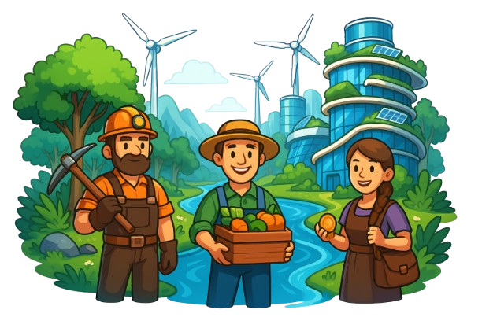

In a digital age flooded with empty promises, Ponzi schemes, and manipulative whales who treat decentralization as just another playground for their profits, I – Flora Dev – knew we needed a revolution rooted in ethics, transparency, and purpose. That seed became **InFlora**.

## The Roots of InFlora

InFlora was born from frustration and hope. Frustration with how the crypto world became fertile ground for scams and soulless tokens. Hope that we could use blockchain not just for speculation, but for *real* systems of value – economic and ecological.

### What is InFlora?

InFlora is a crypto simulation game that mirrors a real, sustainable economy. It is inspired by both the board game *The Game of Life* and modern blockchain games like Rollercoin, but it reimagines them with a mission: **to create an honest, inflation-proof, and community-governed crypto ecosystem.**

Players start as workers – miners, farmers, merchants – and progress by contributing to the virtual world’s economy. Everything runs on $FLORA, our native token, which has a fixed max supply and a fair, transparent mining system.

Withdrawals are made in stablecoins like USDC, while in-game operations happen exclusively with $FLORA. Our liquidity is managed by a central bank governed by the players themselves. No whales, no kings – only the community.

## A Greener Vision

InFlora isn’t just economic. It’s ecological.

The game draws metaphors from nature – growth, cycles, sustainability. We believe crypto can reflect these same values. The more you invest in the ecosystem, the more it thrives – just like in real life.

We're working on creating a regenerative loop: staking, mining, and even "burning" mechanics that give back to the system rather than extract from it.

## Join the Revolution

I didn’t create InFlora to get rich. I created it because I was tired of seeing friends lose money to projects with no soul. Because I believe in a world where crypto can be good – not greedy.

So I’m inviting you – players, builders, dreamers, rebels – to help grow InFlora. Whether it’s through your skills, your ideas, or your financial support, you can be part of this movement.

Let’s build something real.

## 💼 Investor Deck

Looking for a detailed overview of InFlora's game economy, token design and funding roadmap?

[Check our Investor Pitch here](https://brainy-rest-ed8.notion.site/InFlora-Game-Token-Design-Overview-1e010175335680c38f09d51dd12f6a3f)
