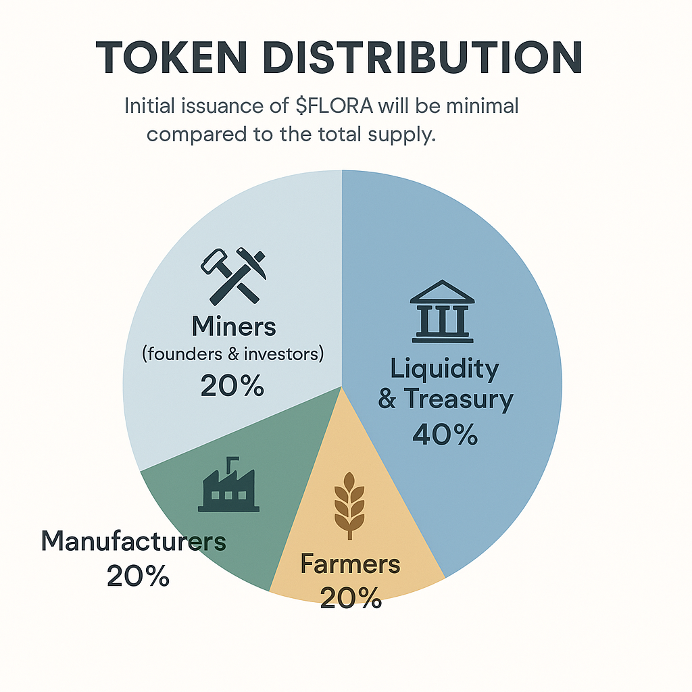

# 🎁 InFlora Airdrop: Become a Founding Player

Welcome to the **Founding Players Airdrop** — where your early support turns into real ownership in the InFlora ecosystem 🌱

We’re not here to promise empty “airdrops.” We’re building a **game-first**, **community-powered** economy — and you’re invited to be part of the origin story.

---

## 🌟 What is a Founding Player?

Founding Players are the **first 21,000 participants** who support the early mint of $FLORA by choosing one of three roles. Each role comes with a starter pack of tokens and early influence in the InFlora world.

| 👤 Role           | 💰 Entry Price | 🎁 $FLORA Allocation | 🎯 Limit per Role |
|------------------|----------------|-----------------------|-------------------|
| 🪨 **Miners**     | $400           | 100,000,000 $FLORA    | 1,000             |
| 🛠️ **Manufacturers** | $100           | 25,000,000 $FLORA     | 4,000             |
| 🌾 **Farmers**    | $25            | 6,250,000 $FLORA      | 16,000            |

🧠 *One role per wallet. No whales allowed — just pure decentralization.*

---

## ⏳ Incubation Phase: 9 Months

This is the countdown to launch. During this time:

- You **buy your role** via our app
- $FLORA is **pre-mined** based on player count
- A **live dashboard** shows:
  - Number of players
  - Amount raised
  - Total $FLORA generated
- Tokens are **airdropped at the TGE** (Token Generation Event)

After TGE, the **State (game treasury)** will no longer mint tokens — it will **earn from transaction fees only**, ensuring sustainable growth 💸

---

## 🧩 Token Distribution at Genesis

Here’s how the total token allocation looks at launch:

| Category         | Tokens                     | Share  |
|------------------|----------------------------|--------|
| 👷‍♂️ Miners         | 100,000,000 $FLORA         | 29.6%  |
| 🏭 Manufacturers   | 100,000,000 $FLORA         | 29.6%  |
| 🌱 Farmers         | 100,000,000 $FLORA         | 29.6%  |
| 🏛️ State Treasury + Liquidity | 120,000,000 $FLORA *(+40%)* | 11.2%  |

💡 *This 40% additional supply is minted to provide liquidity on CEX/DEX and power the in-game treasury.*

---

## 🧭 What Comes Next?

- ✅ Landing page with role purchase & wallet connect
- ⚙️ Smart contract integration & dashboard
- 🚀 Listing platforms like SeedyFi, Binance Labs
- 📦 Token distribution at TGE

---

## ❓FAQ

**Q: Why only 1 role per wallet?**  
A: To prevent whales and ensure fair decentralization.

**Q: Will I get an NFT for my role?**  
A: Yes — your role will be represented as a unique NFT.

**Q: Can I sell my $FLORA before game launch?**  
A: You can hold, sell, or reinvest once TGE happens.

---

🧪 Ready to shape the future of InFlora?  
Click **Play Game** and claim your role in the greenest airdrop of the year 🌿
