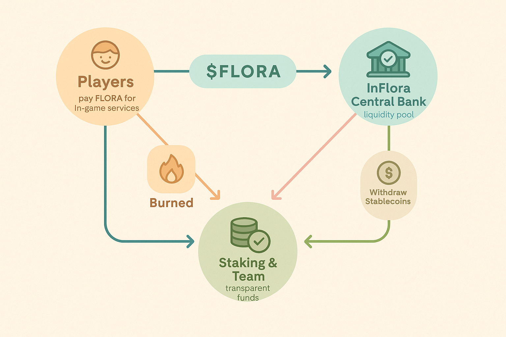

InFlora is designed with sustainability and transparency in mind 🌱. To avoid the most common pitfalls of crypto ecosystems—especially inflation—our economy is based on a **single token model** with built-in mechanisms to ensure stability and long-term growth.

### Single Token System

The $FLORA token is the **only currency** within the game. All in-game activities, purchases, earnings, and upgrades are priced and paid in $FLORA. However, when a player decides to withdraw funds from the game, the value is **exchanged into a stablecoin** (such as USDC) to provide price stability and confidence.

### The InFlora Central Bank 🏦

When players withdraw their in-game profits, a central treasury, called the **InFlora Bank**, acts as the **liquidity provider**. The USDC (or chosen stablecoin) used for withdrawals comes from this pool, and the corresponding $FLORA tokens are either:
- **Staked** to continue generating passive rewards,
- **Burned**, or
- **Held** for ecosystem maintenance, future development, and team compensation.

All funds and balances held in the InFlora Bank are **fully transparent** and accessible to users for verification.

### Burn & Fee Mechanisms 🔥💰

To ensure a deflationary pressure over time and reduce excess token circulation:
- Every **purchase or upgrade** made in-game carries a **burn fee**. This portion of the token is sent to a burn wallet and removed from supply permanently.
- An **additional transaction fee** is charged and redirected to the InFlora Bank for liquidity, ecosystem rewards, and operational costs.

These mechanisms create a **sustainable token economy**, preventing hyperinflation while also reinvesting into the growth of the ecosystem.

### Circular Economy Diagram

Below is a simplified representation of how value flows within the InFlora economy:

Through careful design, InFlora ensures that economic value stays within the system, balancing player incentives, operational funding, and token scarcity.